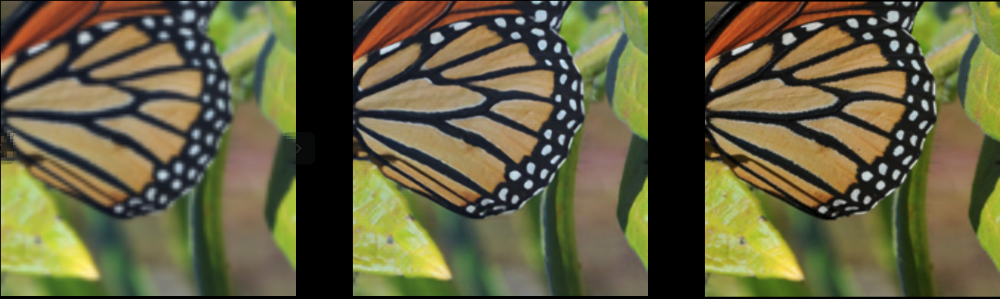

# RCAN-PyTorch

### Overview

This repository contains an op-for-op PyTorch reimplementation of [Image Super-Resolution Using Very Deep Residual Channel Attention Networks](https://arxiv.org/abs/1807.02758).

### Table of contents

- [RCAN-PyTorch](#rcan-pytorch)
    - [Overview](#overview)
    - [Table of contents](#table-of-contents)
    - [About Image Super-Resolution Using Very Deep Residual Channel Attention Networks](#about-image-super-resolution-using-very-deep-residual-channel-attention-networks)
    - [Download weights](#download-weights)
    - [Download datasets](#download-datasets)
    - [Test](#test)
    - [Train](#train)
    - [Improved RCAN](#improved-rcan)
    - [Result](#result)
    - [Credit](#credit)
        - [Image Super-Resolution Using Very Deep Residual Channel Attention Networks](#image-super-resolution-using-very-deep-residual-channel-attention-networks)

## About Image Super-Resolution Using Very Deep Residual Channel Attention Networks

If you're new to RCAN, here's an abstract straight from the paper:

Convolutional neural network (CNN) depth is of crucial importance for image super-resolution (SR). However, we observe that deeper networks for image
SR are more difficult to train. The lowresolution inputs and features contain abundant low-frequency information, which is treated equally across
channels, hence hindering the representational ability of CNNs. To solve these problems, we propose the very deep residual channel attention
networks (RCAN). Specifically, we propose a residual in residual (RIR) structure to form very deep network, which consists of several residual groups
with long skip connections. Each residual group contains some residual blocks with short skip connections. Meanwhile, RIR allows abundant
low-frequency information to be bypassed through multiple skip connections, making the main network focus on learning high-frequency information.
Furthermore, we propose a channel attention mechanism to adaptively rescale channel-wise features by considering interdependencies among channels.
Extensive experiments show that our RCAN achieves better accuracy and visual improvements against state-of-the-art methods.

## Download weights

- [Google Driver](https://drive.google.com/drive/folders/17ju2HN7Y6pyPK2CC_AqnAfTOe9_3hCQ8?usp=sharing)
- [Baidu Driver](https://pan.baidu.com/s/1yNs4rqIb004-NKEdKBJtYg?pwd=llot)

## Download datasets

Contains DIV2K, DIV8K, Flickr2K, OST, T91, Set5, Set14, BSDS100 and BSDS200, etc.

- [Google Driver](https://drive.google.com/drive/folders/1A6lzGeQrFMxPqJehK9s37ce-tPDj20mD?usp=sharing)
- [Baidu Driver](https://pan.baidu.com/s/1o-8Ty_7q6DiS3ykLU09IVg?pwd=llot)

## Test

Modify the contents of the file as follows.

- line 29: `upscale_factor` change to the magnification you need to enlarge.
- line 31: `mode` change Set to valid mode.
- line 70: `model_path` change weight address after training.

## Train

Modify the contents of the file as follows.

- line 29: `upscale_factor` change to the magnification you need to enlarge.
- line 31: `mode` change Set to train mode.

If you want to load weights that you've trained before, modify the contents of the file as follows.

### Resume model

- line 47: `start_epoch` change number of model training iterations in the previous round.
- line 48: `resume` change to SRResNet model address that needs to be loaded.

## Improved RCAN

This repository includes an improved version of RCAN with enhanced attention mechanisms and composite loss functions.

### 🚀 Improvements

#### 1. CBAM Attention Mechanism
- **Channel Attention**: Combines average pooling and max pooling for enhanced channel feature representation
- **Spatial Attention**: Uses 7x7 convolution for spatial feature processing
- **Sequential Integration**: Applies channel attention first, then spatial attention

#### 2. Composite Perceptual Loss
- **L1 Loss**: Ensures pixel-level reconstruction accuracy
- **Perceptual Loss**: Based on VGG19 features for improved visual quality
- **Adversarial Loss**: Uses ESRGAN-style discriminator for enhanced realism

### 📁 New Files

```
├── model.py              # Enhanced with CBAM classes
├── losses.py             # Composite loss function implementation
├── train_improved.py     # Improved training script
├── config_improved.py    # Configuration examples
├── requirements.txt      # Updated with torchvision dependency
└── IMPROVED_USAGE.md     # Detailed usage guide
```

### 🛠️ Quick Start

#### Install Dependencies
```bash
pip install -r requirements.txt
```

#### Train with Improvements
```bash
# Use improved training script (CBAM + Composite Loss)
python train_improved.py

# Or modify config.py to use CBAM model
model_arch_name = "rcan_cbam_x4"  # Instead of "rcan_x4"
```

#### Available Models
- `rcan_x4`: Original RCAN model
- `rcan_cbam_x4`: RCAN with CBAM attention (recommended)
- Support for x2, x3, x4, x8 scales

### ⚙️ Configuration Options

#### Model Selection
```python
# Original RCAN
model_arch_name = "rcan_x4"

# Improved RCAN with CBAM
model_arch_name = "rcan_cbam_x4"
```

#### Loss Function
```python
# L1 loss only (original)
use_composite_loss = False

# Composite loss (L1 + Perceptual + Adversarial)
use_composite_loss = True
l1_weight = 1.0
perceptual_weight = 0.006
adversarial_weight = 0.001
```

### 📈 Expected Improvements

| Configuration | PSNR Gain | SSIM Gain | Visual Quality |
|---------------|-----------|-----------|----------------|
| Original RCAN | Baseline | Baseline | Baseline |
| RCAN + CBAM | +0.2~0.5dB | +0.01~0.02 | Slight improvement |
| RCAN + Composite Loss | +0.1~0.3dB | +0.02~0.04 | Notable improvement |
| RCAN + CBAM + Composite | +0.3~0.8dB | +0.03~0.06 | Significant improvement |

### 💡 Usage Tips

1. **Memory Management**: Reduce `batch_size` if encountering OOM errors
2. **Fine-tuning**: Use smaller learning rates (1e-5) when fine-tuning pretrained models
3. **Loss Weights**: Start with conservative settings and gradually increase perceptual/adversarial weights
4. **Training Time**: Improved version takes 50-70% longer due to additional computations

For detailed usage instructions, see `IMPROVED_USAGE.md`.

## Result

Source of original paper results: https://arxiv.org/pdf/1807.02758.pdf

In the following table, the value in `()` indicates the result of the project, and `-` indicates no test.

| Dataset | Scale |       PSNR       |
|:-------:|:-----:|:----------------:|
|  Set5   |   2   | 38.27(**38.09**) |
|  Set5   |   3   | 34.74(**34.56**) |
|  Set5   |   4   | 32.63(**32.41**) |
|  Set5   |   8   | 27.31(**26.97**) |

Low Resolution / Super Resolution / High Resolution
<span align="center"></span>

### Credit

#### Image Super-Resolution Using Very Deep Residual Channel Attention Networks

_Yulun Zhang, Kunpeng Li, Kai Li, Lichen Wang, Bineng Zhong, Yun Fu_ <br>

**Abstract** <br>
Convolutional neural network (CNN) depth is of crucial importance for image super-resolution (SR). However, we observe that deeper networks for image
SR are more difficult to train. The low-resolution inputs and features contain abundant low-frequency information, which is treated equally across
channels, hence hindering the representational ability of CNNs. To solve these problems, we propose the very deep residual channel attention
networks (RCAN). Specifically, we propose a residual in residual (RIR) structure to form very deep network, which consists of several residual groups
with long skip connections. Each residual group contains some residual blocks with short skip connections. Meanwhile, RIR allows abundant
low-frequency information to be bypassed through multiple skip connections, making the main network focus on learning high-frequency information.
Furthermore, we propose a channel attention mechanism to adaptively rescale channel-wise features by considering interdependencies among channels.
Extensive experiments show that our RCAN achieves better accuracy and visual improvements against state-of-the-art methods.

[[Code]](https://github.com/yulunzhang/RCAN) [[Paper]](https://arxiv.org/pdf/1807.02758)

```
@article{DBLP:journals/corr/abs-1807-02758,
  author    = {Yulun Zhang and
               Kunpeng Li and
               Kai Li and
               Lichen Wang and
               Bineng Zhong and
               Yun Fu},
  title     = {Image Super-Resolution Using Very Deep Residual Channel Attention
               Networks},
  journal   = {CoRR},
  volume    = {abs/1807.02758},
  year      = {2018},
  url       = {http://arxiv.org/abs/1807.02758},
  eprinttype = {arXiv},
  eprint    = {1807.02758},
  timestamp = {Tue, 20 Nov 2018 12:24:39 +0100},
  biburl    = {https://dblp.org/rec/journals/corr/abs-1807-02758.bib},
  bibsource = {dblp computer science bibliography, https://dblp.org}
}
```
